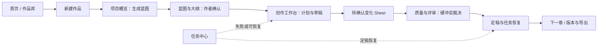

# 瀚霖创作引擎 · 全量产品体验与页面设计方案

> 版本：v1.0 ｜ 日期：2026-07-25 ｜ 状态：设计基线
>
> 依据：[产品 PR](./瀚霖创作引擎-产品PR文档.md)。本文件补足 PR 第 30–36 章的 M0 原型，定义完整产品的页面信息架构、布局、导航与交互边界。它不是对 M2+ 的交付承诺；页面按里程碑解锁，避免未实现能力造成认知负担。

## 1. 设计结论

瀚霖不是“功能很多的聊天工具”，而是作者可长期停留的作品工作台。全局体验围绕一个问题组织：**此刻，我怎样把这部作品安全地往前推进？**

1. **作品先于工具。** 用户先看到作品、下一步和进度；续写、扩写、审校等工具在正文选区、命令面板和上下文中出现，不在顶级导航平铺。
2. **创作优先，管理退后。** 编辑器的正文列保持视觉主导。设定、事实、任务和报告在需要决策时出现，默认不占用写作宽度。
3. **AI 有过程，人有裁决。** 每项生成都能看见来源、输入和状态；所有会改变“已确认事实”或后续章节的操作先说明影响范围、后给出确认。
4. **渐进揭示。** 新作者在首页只有“新建作品、导入作品、继续创作”三个明确入口；首次进入作品时，作品导航只解锁当前可执行步骤。
5. **安静但不冷淡。** 参考图 1 的浅色、细分隔线、紧凑但有呼吸的工作台，而非营销式大卡片。状态使用文字、图标和色彩三重表达。

## 2. 用户、任务与里程碑

| 用户 | 高频目标 | 主要工作台 | 首发范围 |
| --- | --- | --- | --- |
| 新手/网文作者 | 从想法到第一章、持续日更 | 小说项目、写作编辑器 | M0/M1 |
| 职业编剧 | 从梗概到分场、对白与改稿 | 剧本项目、剧本编辑器 | M2 |
| IP 机构 | 评估小说并形成改编方案 | 改编中心、审阅工作台 | M3 |
| 编辑/工作室 | 分派、审稿、统一质量口径 | 团队空间、审稿流 | M4 |
| 管理员 | 成本、权限、模板与审计 | 工作区设置、运营中心 | M4 |

页面可见性遵循“已可用 > 即将开放 > 不展示”。M0/M1 不在主侧栏展示剧本、改编、团队和 API；若已售卖但尚未开通，入口只在账户的“可申请能力”内，以不可点击说明呈现，不能把锁定功能伪装为可用功能。

## 3. 全局信息架构

```text
应用壳
├── 起步
│   ├── 首页 / 今日创作
│   ├── 作品库
│   ├── 新建作品（Sheet）
│   └── 导入作品（Sheet）
├── 当前作品（按最近打开动态出现）
│   ├── 概览
│   ├── 蓝图与大纲
│   ├── 创作
│   ├── 设定与事实
│   ├── 质量与评审
│   ├── 版本与导出
│   └── 任务中心（全局抽屉，也可在作品内筛选）
├── 后续工作区能力
│   ├── 剧本项目
│   ├── 改编中心
│   ├── 团队与审稿
│   ├── 模板与素材
│   ├── 数据与成本
│   └── 开放平台
└── 账户与设置
    ├── 个人偏好
    ├── 工作区、成员和权限
    ├── 版权与合规
    ├── 用量与账单
    └── 开发者设置
```

### 3.1 导航原则与命名

- 一级导航使用作者语言：“蓝图与大纲”“设定与事实”“质量与评审”，不使用 Agent、知识图谱或运行时等实现术语。
- “任务中心”是任何长任务的统一归宿，不是生成器的替代页面。任务失败/可恢复时，页面标题区和任务中心都必须出现同一状态。
- “创建”始终是带 `Plus` 图标的主按钮；“继续创作”是上下文动作，永远回到某个具体作品和章节。
- 全局搜索为命令面板（`Cmd/Ctrl + K`），同时检索作品、章节、角色、事实、任务和命令；默认结果优先显示“继续第 N 章”。

## 4. 侧边栏：让用户始终知道从哪里开始

### 4.1 全局侧边栏（桌面 264 px，收起后 64 px）

```text
┌──────────────────────────────┐
│ [HL] 瀚霖创作引擎        [⌄] │  工作区切换
│ [⌕ 搜索作品、章节、命令  ⌘K] │
│ [+ 新建作品]                  │
│                               │
│ 起步                          │
│  ◈ 今日创作                   │
│  ▣ 作品库                     │
│  ⇧ 导入作品                   │
│                               │
│ 继续创作                      │
│  ● 边城烬火       第 3 章草稿 │
│  ! 雾港来信       1 个待处理  │
│  ○ 长夜微光       蓝图待确认  │
│  查看全部作品                  │
│                               │
│ 资源                          │
│  ◇ 模板与灵感                 │
│  ◷ 任务中心              [2] │
│                               │
│ ──────────────────────────── │
│ [头像] 吴敏          [设置]   │
└──────────────────────────────┘
```

| 区域 | 设计规则 | 目的 |
| --- | --- | --- |
| 工作区与搜索 | 顶部固定；搜索为输入框而非只显示图标 | 让“找内容”和“找动作”都有可见入口 |
| 新建作品 | 40 px 高的唯一高强调按钮 | 首次用户不用从长菜单猜测起点 |
| 起步 | 永远只保留首页、作品、导入三个动作 | 收敛新手决策，避免功能清单化 |
| 继续创作 | 最多显示 3 项，每项展示“下一步”或风险，而不是仅标题 | 直接恢复中断任务，减少重新定位 |
| 资源 | 模板、任务中心是跨作品对象；不放编辑工具 | 区分内容工作与辅助能力 |
| Footer | 账户、外观、快捷键、帮助收进用户菜单 | 保持主导航专注 |

状态圆点语义：实心强调色 = 可继续；琥珀感叹号 = 需作者裁决；空心 = 已暂存但尚未开始。每个状态都带文字，收起时图标有 Tooltip；禁止仅用红绿颜色。当前页面采用浅薄荷底、2 px 青绿色左边框/描边和深色图标，风格与图 1 的已选任务一致。

### 4.2 作品级侧栏（在“当前作品”内替换全局中段）

```text
┌──────────────────────────────┐
│ ‹ 作品库                      │
│ 《边城烬火》              [⋯] │
│ 3 / 10 章 · 12,480 字         │
│ ███████░░░ 30%                │
│                               │
│ 进行中                        │
│  ▶ 继续第 3 章                │
│  ! 处理 2 条待确认变化        │
│                               │
│ 作品                          │
│  ◈ 概览                       │
│  ◫ 蓝图与大纲                 │
│  ✎ 创作                       │
│     第 1 章  已定稿           │
│     第 2 章  已定稿           │
│     第 3 章  草稿 v2          │
│  ◇ 设定与事实            [2] │
│  ✓ 质量与评审            [1] │
│  ◷ 版本与导出                 │
│                               │
│ [收起]                         │
└──────────────────────────────┘
```

章节树只有在“创作”展开后出现，默认定位当前章节。蓝图未确认时，仅解锁“概览、蓝图与大纲”；章节计划确认后解锁“创作”；有内容才显示“设定与事实、质量与评审、版本与导出”。这样侧边栏既完整承载能力，又始终按作者当前阶段给出下一步。

对 M2+，在项目类型为剧本时将“蓝图与大纲”改名为“开发与分场”，创作子树显示幕/场；改编项目追加“原作映射”。导航顺序和状态语义不变，避免用户重新学习。

## 5. 页面总表

| ID | 页面/面板 | 服务的核心任务 | 里程碑 | 主入口 |
| --- | --- | --- | --- | --- |
| P01 | 今日创作 | 找到今天最重要的一步 | M1 | 全局侧栏 |
| P02 | 作品库 | 管理、筛选、重开作品 | M0 | 全局侧栏 |
| P03 | 新建作品向导 | 一句话/模板/导入起稿 | M0 | 主按钮 |
| P04 | 导入预览 | 安全迁移已有存稿 | M1 | 全局侧栏、P02 |
| P05 | 作品概览 | 判断作品健康度和下一步 | M1 | 作品侧栏 |
| P06 | 蓝图与大纲 | 确认方向、结构、章节计划 | M0 | 作品侧栏 |
| P07 | 小说创作工作台 | 生成、编辑、裁决、定稿 | M0 | 继续创作、章节树 |
| P08 | 设定与事实 | 维护角色、世界观、时间和伏笔 | M1 | 作品侧栏 |
| P09 | 质量与评审 | 解决硬冲突并优化稿件 | M1 | 作品侧栏 |
| P10 | 版本与导出 | 比较、恢复、交付确认内容 | M1 | 作品侧栏 |
| P11 | 任务中心 | 追踪、恢复、取消长任务 | M0 | 全局侧栏、顶部状态 |
| P12 | 剧本开发与编辑器 | 从梗概到分场、对白、改稿 | M2 | 剧本项目 |
| P13 | 改编中心 | 评估、取舍、小说/剧本映射 | M3 | 项目能力 |
| P14 | 团队与审稿 | 协作、批注、意见整合 | M4 | 工作区能力 |
| P15 | 模板与素材 | 复用题材、文风与素材 | M2/M4 | 全局资源 |
| P16 | 数据与成本 | 回看产出、质量与预算 | M4 | 工作区能力 |
| P17 | 版权与合规 | 管理标识、查重、申诉与授权 | M1/M4 | 账户、项目导出 |
| P18 | 设置与开发者 | 偏好、权限、账单、API | M1/M4 | 用户菜单 |

## 6. M0/M1 核心页面规格

### P01 今日创作

**目的**：让返回用户在 10 秒内进入唯一最值得处理的作品节点。

布局：页头为“今天，继续让故事向前”与日期，右侧为 `新建作品`；第一屏左侧为“继续创作”主卡，右侧为“待你决定”（事实、冲突、恢复）；下方为最近作品列表和一条轻量周进度。没有作品时替换为一张非营销式空状态，提供“从一句话开始”“导入存稿”“从模板起稿”三个并列动作。

排序规则：可恢复任务 > 硬冲突/待裁决 > 当前草稿 > 最近打开 > 已完成作品。此规则要在产品层固定，不能仅按更新时间排序。

### P02 作品库

布局：标题区包含搜索、状态筛选、排序和“导入/新建”；内容区是单列紧凑作品行，不使用大型封面墙。每行包含标题、文体、最新章节、总字数、进度、最近活动、下一步和风险计数；行尾菜单为归档、复制、删除。左侧仅在宽屏出现状态筛选（全部、进行中、待处理、已完成、归档），窄屏进入 Filter Sheet。

空状态说明下一步而不介绍产品：`还没有作品`，主按钮“新建作品”，次按钮“导入已有存稿”。加载时用与作品行相同高度的 Skeleton，错误时保留已缓存列表并给出重试。

### P03 新建作品向导（右侧 Sheet，宽 560 px）

入口后先选择三个起稿方式：`从一句话开始`、`使用模板`、`导入已有作品`。只在选择后展示相应表单，避免同屏出现所有字段。

1. **故事方向**：题材、主题/梗概（必填）、创作目标；AI 提供最多三个可采纳方向，不强制聊天。
2. **作品规模**：小说/剧本、篇幅、目标章节/集数、每章字数、叙事视角。高级模型和风格设置折叠在“创作偏好”。
3. **确认创建**：明确显示将生成的第一个产物和预计时间/预算；提交后 Sheet 关闭，直接跳转项目概览，任务状态留在顶部和任务中心。

关闭向导需询问“保存草稿/放弃”，而不是静默丢弃输入。新手默认小说，M2 才显示剧本类型；M3 才显示“从原作改编”。

### P04 导入预览

三栏布局：左栏文件队列与格式说明；中栏为章节切分预览和原文只读检查；右栏为 AI 提取的角色、地点、时间、伏笔与低置信度项。右栏所有结果默认“待确认”，不能自动写入事实层。底部固定操作为“保留原文件并创建草稿项目”与“取消”。

导入失败不覆盖原文件。解析置信度低于阈值时，明确显示“需要你确认”，并允许仅导入章节、不导入设定。

### P05 作品概览

第一屏回答三件事：进展到哪里、现在需要决定什么、下一步能做什么。页头显示面包屑、标题、文体/进度、更多菜单；主操作永远是与状态匹配的“确认蓝图”“开始第 N 章”“继续恢复”或“查看待处理”。

内容使用两列不嵌套卡片的带状布局：

| 区块 | 内容 | 行为 |
| --- | --- | --- |
| 下一步 | 一条明确行动、前置条件、预计耗时 | 单一主按钮，跳到具体页面 |
| 创作进度 | 卷/章进度、字数、近 7 日产出 | 点击定位章节树 |
| 待你决定 | 待裁决事实、硬问题、失败恢复 | 风险优先，点击打开对应抽屉 |
| 作品脉络 | 当前蓝图摘要、活跃角色/伏笔、最近定稿 | 只读摘要，进入详情 |
| 最近活动 | 人工编辑、AI 任务、版本恢复 | 点击进入版本或任务详情 |

### P06 蓝图与大纲

采用“左树、中编辑、右影响”三栏，正文区域至少 640 px。左树是作品圣经、角色、世界观、卷/幕、章节；中栏为当前条目编辑器；右栏固定显示“受影响内容”，无影响时默认收起。蓝图保存是失焦自动保存，确认动作是明确按钮，确认后生成目录。

大纲使用可拖拽的卷/章列表，每张章卡只显示标题、目标、冲突、人物、钩子和状态；拖拽前后显示影响数。若影响已定稿章节，必须先打开影响确认 Dialog，提供“只影响后续”“创建分支”“取消”。

章节计划不独立成为顶级页面：从章节树或创作工作台顶部打开；基础字段（目标、人物、钩子）默认展开，其余时间、地点、伏笔使用“更多约束”。

### P07 小说创作工作台

```text
┌ 顶栏：〈作品库 / 边城烬火 / 第 3 章〉 [保存状态] [任务] [导出] [更多] ┐
├──────────┬─────────────────────────────────────┬────────────────┤
│作品侧栏  │ 章节标题 + 目标摘要                   │上下文(可收起)  │
│章节树    │ [生成] [版本] [定稿]                  │计划 | 事实 | 问题│
│          │─────────────────────────────────────│                │
│          │        正文编辑器（唯一长滚动）        │与本章相关的    │
│          │                                     │人物/伏笔/问题  │
│          │─────────────────────────────────────│                │
│          │ 草稿 v2 · 来源 · 1,842 字 · 保存时间  │                │
└──────────┴─────────────────────────────────────┴────────────────┘
```

左栏 240 px，正文列最小 640 px、最大 860 px，右栏 320 px，窗口 1024–1279 px 时右栏默认收起。正文为 18 px、1.8 行高，编辑区无边框大卡片；只有顶部工具行和底部元信息以细线分隔。

工具条：`生成草稿`、`版本`、`定稿`是文字命令；撤销、重做、收起上下文、更多用带 Tooltip 的图标按钮。选中文本时出现紧贴选区的微工具条：续写、扩写、缩写、改写、润色和“输入要求”，所有结果生成新修订，绝不原地替换。

生成前打开内联章节计划确认区；生成中显示增量文本、字数、停止按钮和任务阶段，停止也保留当前可编辑草稿。自动保存 750 ms 防抖；网络异常标记“仅本地草稿”，恢复后允许确认同步。定稿前自动打开 P08 的待确认变化 Sheet，并将硬冲突阻断原因写在禁用按钮下方。

### P08 设定与事实

页面顶部为搜索和时间点选择器（“当前定稿 / 第 N 章后”）。左栏为分类：角色、世界观、地点、物品、时间线、伏笔、文风；中栏为可编辑事实列表；右栏为来源与变更历史。每条事实必须显示来源章节、状态和最近修改者。

专用视图：

- **角色卡**：当前状态、动机、关系、出场章节、版本历史；M1 采用结构化列表，M2 再提供关系图。
- **时间线**：纵向事件流，冲突在事件间显示而非用抽象告警。
- **伏笔账本**：埋设、推进、回收、超期四种筛选；每条可跳回原文锚点。
- **待确认变化 Sheet**：从右侧覆盖但不遮挡原文；逐项展示“原值 → 建议值、原文证据、置信度”，提供接受、编辑后接受、不记录。

### P09 质量与评审

页头显示质量结论与上次检查时间，主视图按“必须处理 / 建议优化 / 已忽略”分组，而非按模型分类。每条问题包含严重度、可读规则名、涉及事实、原文证据、建议动作和裁决历史。点击问题时：桌面端以右侧抽屉显示原文，并提供跳转编辑器；移动端进入问题详情页。

全书体检页面使用全宽内容带：章节节奏、角色弧、伏笔回收、重复表达和查重摘要。图表只在帮助判断时出现，且每个图表有可执行的下一步列表。评审建议默认不阻断；硬事实、合规、未裁决变化才阻断定稿或导出。

### P10 版本与导出

默认页签是“章节版本 / 蓝图历史 / 导出记录”。版本列表按章节分组，显示来源（AI、作者、恢复）、状态、时间和字数。选中两版后以并排或统一 diff 显示，恢复前要说明将切换的当前指针、受影响的计划/事实/索引，且恢复永远生成事件不删除历史。

导出采用 Sheet：选择 txt、md、docx（可用后），预览章节范围、版本号、AI 标识、未解决风险和导出原因。若有 P0 问题，仅允许“导出已定稿章节”或“强制导出并填写原因”。完成后保留可下载条目和审计记录。

### P11 任务中心（全局 Sheet + 独立页）

顶部任务按钮始终有数值徽标，点击从右侧打开 480 px Sheet；需要审计/过滤时进入完整页。列表按“需要你处理、运行中、可恢复、已完成”分组，显示人类任务名、所属作品、阶段、进度、耗时和最近错误。允许的动作由状态决定：取消、重试、继续恢复、查看产物；不能只显示技术日志。

失败恢复卡固定表达三点：已安全保存什么、恢复点在哪里、当前可选动作。绝不以 Toast 代替可恢复状态。

## 7. M2+ 专业能力页面

### P12 剧本开发与编辑器

剧本项目沿用 P05–P11 的骨架，只替换创作语义：

| 页面 | 关键结构 | 差异化交互 |
| --- | --- | --- |
| 开发与分场 | 左侧 Logline、梗概、人物、节拍、分场树；中间编辑；右侧时长/影响 | 三幕式、五幕式、起承转合切换后显示影响，而非覆盖 |
| 场景编辑器 | 左侧场次树，中间 Fountain/标准格式编辑器，右侧场景功能与人物声音 | Tab/Enter 按剧本元素推进；场景头、动作、角色、对白、括注可键盘切换 |
| 对白工坊 | 上方原对白与角色声音，下面 2–3 个候选版本 | 选择候选会创建版本；显示潜台词、压迫感等处理意图 |
| 批注改稿 | 右侧批注流，正文证据高亮，底部版本比较 | 导入不同角色意见后先归并冲突，再允许逐条应用 |
| 剧本体检 | 节拍、场景功能、对白、时长、格式五栏 | 缺少戏剧功能的场景在分场树中显示可读原因 |

### P13 改编中心

首页先让机构选择“评估原作”或“开始改编”。项目内采用三栏：原作章节/角色树、改编方案（主线、取舍、名场面、集/幕结构）、影响与溯源。任何删减、合并、视角转换都必须显示“取舍理由”和受影响章节，不能只输出一篇不可追溯报告。

对照审阅按场景/事件对齐，而不是逐字并排。左侧是原作锚点，中间是剧本场景，右侧是保真、删改理由和人工批注；点击任意一端同步滚动到另一端。

### P14 团队与审稿

工作区页包含成员、项目、审稿流、审计四个页签。项目内出现“协作”页签，而非另造一个协作产品：章节提交后形成审稿队列，责编/主编按权限查看、批注、请求修改、通过。批注与 AI 改写关联到具体版本，不可漂移到后续正文。所有团队数据在页头明确空间归属和权限，个人作者不看到该入口。

### P15 模板与素材

模板库不是商城首页。默认按“从什么开始”组织：题材骨架、开篇方案、角色关系、文风规则、剧本结构。每个模板卡在列表中展示适用文体、预计产物、作者、是否已验证；详情页显示可编辑预览与“用此模板创建作品”。

全局素材页管理可复用资料卡、研究引用、角色/世界观片段；拖入项目时默认复制，明确提示是否建立同步链接，防止全局编辑意外改动历史项目。

### P16 数据与成本

服务工作区管理员和专业作者。顶部时间范围切换，下方依次为 WAW/产出、质量与人工干预、任务成功率/时长、预算与成本。每张数据区直接列出异常与处理动作，例如“连续三章人工修改率高：查看评审/调整创作偏好”，不做孤立数字仪表盘。

### P17 版权与合规

项目级页面显示作品 AI 生成标识、查重结果、合规扫描和申诉记录；账户级设置管理训练 opt-out、授权材料和数据隔离承诺。红线问题遵循最小暴露：展示规则类别、位置、风险和可行改写，不在导航或通知中回显敏感原文。

### P18 设置与开发者

个人设置：外观、快捷键、默认创作偏好、通知。工作区设置：成员、角色、数据与账单。开发者页：API 密钥、Webhook、使用日志和速率限制，仅对有权限角色出现；所有密钥仅在创建时显示一次。

## 8. 共享布局与视觉规格

### 8.1 参考图的转译

以图 1 的应用壳为基准：浅灰绿页面底、白色主内容、`#D7DFDA` 级细边框、左栏与内容区明确分割、控件 6–8 px 圆角、以青绿色作为选择与主操作色。图 2 的信息密度、顶部搜索和工作区切换可借鉴，但不复制其黑底和高饱和卡片视觉。

| 令牌 | 值 | 用途 |
| --- | --- | --- |
| `--hl-canvas` | `#F7F9F8` | 应用与侧栏底色 |
| `--hl-surface` | `#FFFFFF` | 正文、Sheet、菜单 |
| `--hl-ink` | `#17201D` | 标题与主要文字 |
| `--hl-muted` | `#62716A` | 辅助文字、未激活图标 |
| `--hl-line` | `#D7DFDA` | 分隔线、默认边框 |
| `--hl-primary` | `#087F5B` | 选中、主操作、完成 |
| `--hl-primary-soft` | `#EAF5EF` | 选中导航、低强调成功 |
| `--hl-info` | `#2563EB` | 可恢复/进行中 |
| `--hl-warning` | `#B45309` | 待确认、预算警告 |
| `--hl-danger` | `#B91C1C` | 阻断、破坏性操作 |
| `--hl-radius` | `6px` | 标准组件圆角 |
| `--hl-radius-card` | `8px` | 单一内容卡片最大圆角 |

研发应将上述语义映射到 `packages/ui` 的主题变量，业务页面不硬编码色值、间距或圆角。卡片仅用于单个作品、版本、任务、模板等可重复对象；页面区块使用无卡片的全宽内容带和分隔线，禁止卡片套卡片。

### 8.2 栅格、间距、排版

| 视口 | 外边距 | 主布局 | 行为 |
| --- | --- | --- | --- |
| >= 1440 px | 32 px | 264 px 全局/作品栏 + 流式主区 | 写作区允许三栏 |
| 1024–1439 px | 24 px | 240 px 作品栏 + 主区 | 上下文栏默认收起为 Sheet |
| 768–1023 px | 20 px | 主区 | 侧栏变抽屉；只保留轻量编辑与裁决 |
| < 768 px | 16 px | 单列 | 阅读、裁决、轻编辑；复杂生成/版本比较提示到桌面 |

采用 4 px 基准：4、8、12、16、24、32、40、48。顶栏 64 px，主页面标准内边距 24 px，表单字段间距 16 px，区块间距 32 px。UI 正文 16 px，辅助文字 14 px，区块标题 18 px，页面标题 28 px；创作正文 18 px、行高 1.8、字距 0、最大行宽 860 px。字体大小不随视口缩放。

### 8.3 组件与状态

| 组件 | 规格 |
| --- | --- |
| 按钮 | 主命令为 40 px，图标按钮最小 40 x 40；生成、定稿、导出可用图标+文字，撤销/收起/更多使用 Lucide 图标+Tooltip |
| 标签/Badge | 只表示状态和计数，不能代替操作；文本必须包含状态含义 |
| 输入 | 搜索、数值、短文本用 Input；长内容用 Textarea/富文本；二元设置用 Switch；模式使用分段控件 |
| Sheet/Dialog | Sheet 处理就地编辑、裁决、导出；Dialog 只用于高影响确认。关闭后焦点回到触发点 |
| Empty/Skeleton/Error | 每个页面均需设计无数据、加载、权限不足、网络失败、可恢复失败五种状态；错误不清空已保存内容 |
| Toast | 仅用于失败、恢复成功、导出完成等短反馈；保存状态在原位置静态表达 |

### 8.4 无障碍和键盘

- 所有对比度达到 WCAG AA；色彩状态同时有图标和文字。
- `Cmd/Ctrl + K` 打开命令面板，`Cmd/Ctrl + S` 保存，`Cmd/Ctrl + Enter` 在非 IME 输入时生成，`Cmd/Ctrl + .` 切换上下文，`Cmd/Ctrl + Shift + P` 打开问题。
- 所有异步状态通过克制的 `aria-live` 表达；流式生成不逐字播报。
- 移动端不隐藏风险信息；将复杂操作改为查看详情或明确引导到桌面，不以不可用按钮作为唯一反馈。

## 9. 跨页面关键流程



每次跨页只传递作品 ID、章节/场景 ID、版本 ID 和焦点上下文；浏览器不得知道 Runtime 任务地址或模型密钥。任务进度由公开 NestJS 契约提供，Python 只作为受控执行端。

## 10. 原型与验证计划

先完成 M0/M1 的中保真桌面原型：P01、P02、P03、P05、P06、P07、P08 的裁决 Sheet、P10 的版本恢复和 P11 的失败恢复。原型至少覆盖完整首章路径与“硬事实冲突 + 可恢复定稿失败”两条异常路径。

与 5–8 位中文小说作者测试以下任务：从主题创建作品并修改一项蓝图；确认第 1 章计划、生成两版并恢复首稿；接受/编辑/拒绝事实变化；从失败任务恢复并导出已定稿章节。目标是任务完成率 >= 85%，事实裁决正确率 >= 80%，恢复任务在 2 分钟内完成率 >= 80%，SUS >= 68（目标 80）。未达标先修导航命名、信息层级和裁决文案，再进入高保真和工程冻结。

## 11. 研发交付边界

1. 前端基于现有 `packages/ui` 组装，不复制基础组件；路由从当前单页工作台拆分到作品域页面，但 M0 可先以同一路由内的状态面板过渡。
2. API 继续采用 Zod-first、ts-rest；页面状态只消费 NestJS Studio 公开契约，禁止浏览器直连 Python Runtime。
3. 所有可能改变历史和下游内容的界面都必须依赖真实的版本、事实、Run、审校和审计状态，不能用前端本地“已完成”模拟。
4. M0 先实现 P02、P03、P06、P07、P11；M1 补齐 P01、P04、P05、P08、P09、P10、P17；M2+ 页面在对应领域契约具备前只保留本设计文档，不提前挂入口。
